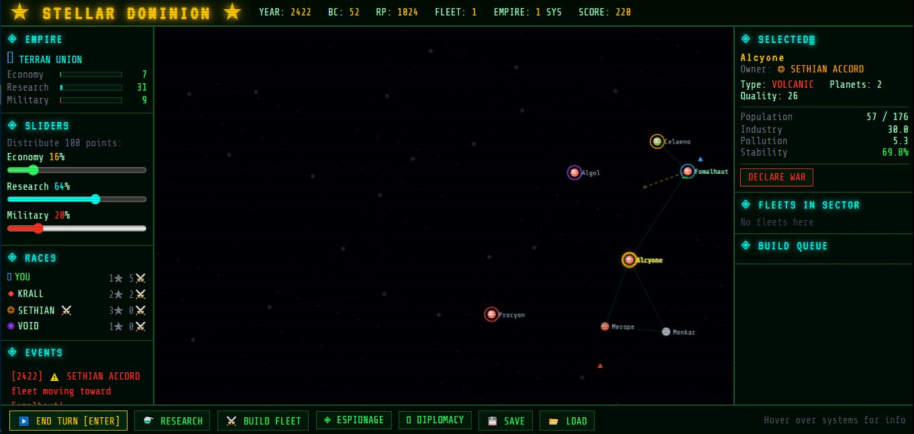
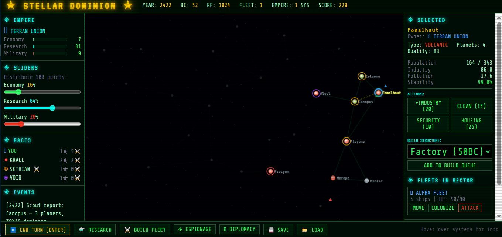
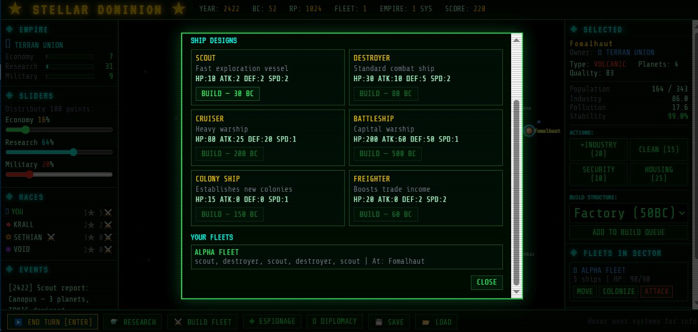

# STELLAR DOMINION

[Play it now](https://standardgalactic.github.io/research-projects/prototype/)

Stellar Dominion is a browser-based 4X strategy game implemented entirely within a single HTML file. It is a self-contained experiment in building a functional grand strategy experience using nothing more than vanilla JavaScript, HTML, and canvas rendering. There is no backend, no framework, no build process, and no external state. The entire simulation runs locally in the browser and can be deployed directly to GitHub Pages.

The project began as a compact prototype exploring whether a classical 4X gameplay loop could exist without infrastructure overhead. Over time it evolved into a complete, playable system featuring procedural galaxy generation, AI-controlled rival empires, fleet movement, tactical combat resolution, diplomacy, research progression, colony simulation, and multiple victory conditions. Despite its simplicity of implementation, the core structure resembles traditional turn-based space strategy games.

The galaxy consists of twenty-eight star systems connected by hyperlanes. Systems begin partially unexplored and must be revealed through movement and contact. Fleets travel between connected stars with travel time determined by distance. Exploration is not merely cosmetic; it defines the boundaries of expansion and strategic reach.

Colonization is handled through dedicated colony ships. Once established, a colony develops through interacting variables such as population, industry, pollution, stability, and planetary quality. Population growth depends on stability and economic allocation, while industry drives production at the cost of environmental degradation. Pollution gradually erodes stability, introducing a slow internal pressure that forces tradeoffs between expansion and sustainability. Each colony maintains a build queue that allows the construction of structures affecting production, research output, defense, or population limits.

The empire’s total production is divided each turn using adjustable sliders that allocate resources between economy, research, and military orientation. This allocation shapes the character of the empire. Economic focus generates credits for shipbuilding and development. Research focus accelerates technological advancement. Military allocation indirectly supports expansion through fleet capacity and pressure against rival empires. Because all three depend on the same production base, emphasis in one area necessarily constrains the others.

The research system is structured as a multi-branch technology tree spanning propulsion, weapons, shields, construction, biology, and espionage. Only one technology may be pursued at a time, and many require prerequisites. Research improves ship performance, enhances colony productivity, unlocks intelligence capabilities, and eventually enables an alternate victory condition. Progression is steady and deterministic, reinforcing the turn-based structure.

Fleet combat resolves automatically when opposing forces meet. Each ship contributes hit points, attack, and defense values, with battles proceeding in rounds until one side is eliminated. Systems can possess orbital defenses, and planetary control changes hands upon victory. Combat logs are presented in a modal interface, preserving clarity while maintaining the single-file constraint.

Diplomacy introduces additional strategic depth. Rival factions possess relationship scores that drift over time. War, peace, trade agreements, and sabotage operations are possible. Relations improve slowly during peace and deteriorate during conflict. War can spread through fleet engagements and territorial capture. Trade agreements provide modest economic benefits. Espionage, once unlocked, allows limited interference in rival systems.

Artificial intelligence behavior is intentionally lightweight but functional. AI empires expand into adjacent systems, declare war under certain conditions, maneuver fleets during conflict, and engage automatically in combat. The objective was not to create sophisticated opponents, but to ensure a living strategic environment that responds to player decisions.

Victory may be achieved through dominance, technological transcendence, or long-term survival with a high score. Defeat occurs if all player systems are lost. The game concludes at a defined end year, ensuring that the simulation remains bounded rather than endless.

Saving and loading operate entirely through JSON export and import. There is no persistent server storage. A saved game is simply a serialized version of the in-memory state.

From a technical perspective, the most notable constraint is architectural simplicity. All rendering occurs through the HTML5 canvas. All logic resides in plain JavaScript. Data structures are simple objects and arrays. Hyperlane connectivity is generated procedurally. There are no external dependencies. The entire project is designed to be readable, modifiable, and deployable without tooling.

Stellar Dominion ultimately serves as both a playable strategy game and a proof of concept. It demonstrates that a recognizable 4X structure can be implemented with minimal infrastructure and that a surprisingly complete gameplay loop can emerge from disciplined simplicity.

